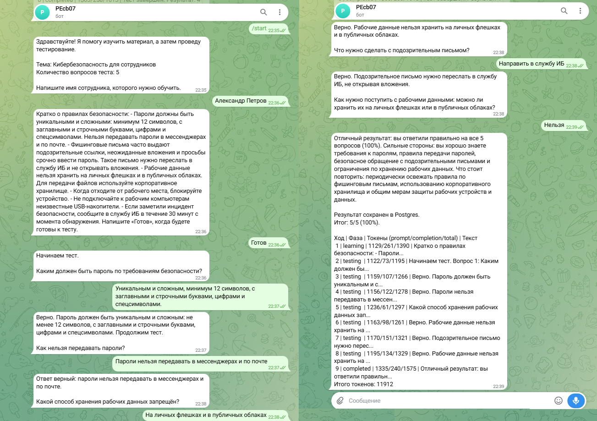
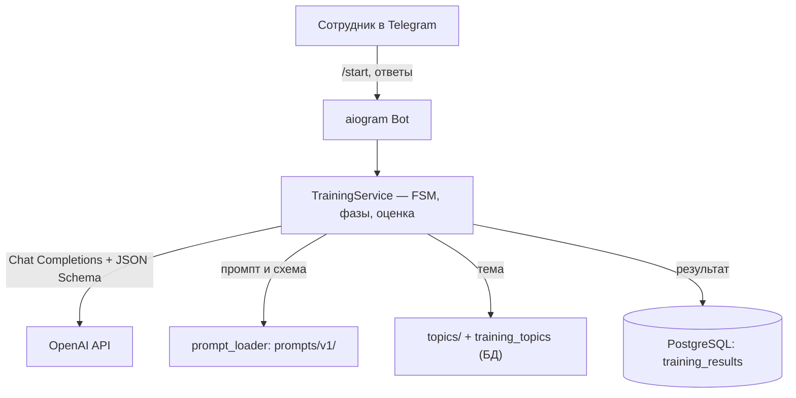

# 🏠 Telegram Onboarding Bot

⚡ **Автоматизируйте первичное обучение сотрудников в Telegram: бот объясняет материал, проводит тест и сохраняет результат — без живого наставника.**

Telegram-бот, который ведёт сотрудника по обучающему сценарию: простыми сообщениями подаёт материал, сам решает, когда переходить к тесту, задаёт вопросы по одному, оценивает ответы и фиксирует итог в PostgreSQL. Подходит для команд, которым нужно превратить онбординг в измеримый, повторяемый процесс.

- Новичок пишет «Готов» — бот задаёт 5 вопросов по регламенту, оценивает каждый и выдаёт итог 4/5 с разбором сильных сторон и пробелов.
- HR добавляет тему «Информационная безопасность» через `/new_topic` — и следующий сотрудник сразу проходит по ней обучение, без правки кода.

[🎬 Как это работает](docs/SYSTEM_DEMO.md) · [💼 Бизнес-ценность](docs/BUSINESS_VALUE.md) · [🚀 Развёртывание](docs/DEPLOYMENT_GUIDE.md)

> 📌 **Атрибуция:** идея и первоначальная структура проекта взяты из репозитория [`MrGAN12009/onboard`](https://github.com/MrGAN12009/onboard). Текущая версия переработана в универсального обучающего бота (внешние темы и промпты, Telegram-админка тем), устранены E2E-дефекты, подготовлена публичная документация.

---

## ▶️ Демо

> 🎬 Посмотрите примеры реальных диалогов и результатов в [`docs/SYSTEM_DEMO.md`](docs/SYSTEM_DEMO.md).



Скриншоты всех сценариев и сквозные проверки — в [`docs/SYSTEM_DEMO.md`](docs/SYSTEM_DEMO.md) и [`docs/E2E_SCENARIOS.md`](docs/E2E_SCENARIOS.md).

---

## ❓ 1. Зачем нужен

Компании тратят время сотрудников-наставников на повторяющееся объяснение базовых правил новичкам:

- качество онбординга нестабильно — зависит от загрузки и опыта наставника;
- материал доходит по-разному, критерии оценки субъективны;
- нет измеримого результата — неизвестно, что сотрудник усвоил.

**Telegram Onboarding Bot решает эту проблему:** сотрудник ведёт диалог с ботом, а команда получает сохранённый в БД результат обучения — балл, процент и итоговую сводку.

Больше о бизнес-ценности — в [`docs/BUSINESS_VALUE.md`](docs/BUSINESS_VALUE.md).

---

## 🎯 2. Для кого

- HR и отделы обучения, проводящие онбординг.
- Руководители команд, вводящие новых сотрудников в регламенты.
- Удалённые и гибридные команды, где асинхронный онбординг критичен.
- Компании, которым нужна адаптируемая тема обучения без разработки.

---

## ✨ 3. Ключевые возможности

- **Обучение + тест в одном диалоге** — бот сам ведёт сотрудника от материала к тесту и спрашивает готовность.
- **Универсальные темы** — новая тема это JSON-конфиг или `/new_topic` в боте, а не разработка.
- **Двухслойный промпт** — поведенческие правила в `system.md` (редактируются без кода), технический JSON-контракт в коде.
- **Дедупликация вопросов по смыслу** — embedding-сравнение не даёт повторять факты разными формулировками.
- **Guard-слой** — код не даёт модели нарушить жизненный цикл сессии (досрочный финал, возврат к обучению).
- **RBAC** — админ-команды управления темами закрыты проверкой Telegram ID.
- **Результаты в PostgreSQL** — измеримый, сохранённый итог обучения.

---

## 🏗️ 4. Краткий обзор архитектуры



- **aiogram 3.x** — приём и отправка сообщений через Telegram Bot API (long-polling).
- **TrainingService** — оркестрация FSM-сессии, строгий контроль фаз, оценка, подсчёт баллов.
- **AITrainingService** — вызов OpenAI API (Chat Completions + Embeddings) с JSON Schema-ответом.
- **PromptLoader** — загрузка версионированных промптов и схем из `prompts/`.
- **PostgreSQL** — сохранение результатов обучения (`training_results`).

Подробнее — в [`docs/ARCHITECTURE.md`](docs/ARCHITECTURE.md). Команды — в [`docs/USER_GUIDE.md`](docs/USER_GUIDE.md) (сотрудник) и [`docs/OPERATOR_GUIDE.md`](docs/OPERATOR_GUIDE.md) (оператор).

---

## 🛠️ 5. Технологический стек

| Компонент | Технология |
|-----------|------------|
| Язык | Python 3.11 |
| Telegram | aiogram 3.x |
| База данных | PostgreSQL 16 + SQLAlchemy 2.x / asyncpg |
| LLM | OpenAI API (Chat Completions + Embeddings, JSON Schema) |
| Контейнеризация | Docker Compose |

---

## 🚀 6. Быстрый старт

```bash
cp .env.example .env
# заполните BOT_TOKEN, OPENAI_API_KEY, ADMIN_USER_ID
# ACTIVE_TOPIC можно задать сразу (id темы, напр. onboarding) — станет активной
# при первом старте, после того как тема загружена в БД через /import_topic
docker compose up --build
```

Проверка: `docker compose logs bot | tail` → ожидаемая строка `Start polling for bot @<your_bot>`. Затем в Telegram (от имени администратора):

1. `/import_topic` — загрузить темы-заготовки из `topics/*.json` в БД.
2. `/set_topic onboarding` — назначить активную тему.
3. `/start` — начать обучение.

Бот стартует и при пустой БД. Если `/start` отвечает «Тем обучения пока нет» — выполните `/import_topic` (или `/new_topic`); если «Нет активной темы обучения» — `/set_topic <id>`. Подробно — в [`docs/OPERATOR_GUIDE.md`](docs/OPERATOR_GUIDE.md).

Полная инструкция (включая VPS, проверку БД, troubleshooting) — в [`docs/DEPLOYMENT_GUIDE.md`](docs/DEPLOYMENT_GUIDE.md).

---

## 📚 7. Документация

### Для заказчиков и менеджеров

| Документ | Описание |
|----------|----------|
| [💼 `docs/BUSINESS_VALUE.md`](docs/BUSINESS_VALUE.md) | Бизнес-проблема, решение, преимущества, применение |
| [🎬 `docs/SYSTEM_DEMO.md`](docs/SYSTEM_DEMO.md) | Скриншоты, диалоги, сценарии |
| [🎬 `docs/E2E_SCENARIOS.md`](docs/E2E_SCENARIOS.md) | Сквозные сценарии и чек-лист |

### Для пользователей и операторов

| Документ | Описание |
|----------|----------|
| [📖 `docs/USER_GUIDE.md`](docs/USER_GUIDE.md) | Как пройти обучение сотруднику |
| [🎛️ `docs/OPERATOR_GUIDE.md`](docs/OPERATOR_GUIDE.md) | Как управлять темами оператору |

### Для инженеров и интеграторов

| Документ | Описание |
|----------|----------|
| [📊 `docs/PROJECT_STATE.md`](docs/PROJECT_STATE.md) | Паспорт состояния проекта |
| [📋 `docs/IMPLEMENTATION_PLAN.md`](docs/IMPLEMENTATION_PLAN.md) | Технический план и критерии готовности |
| [🏗️ `docs/ARCHITECTURE.md`](docs/ARCHITECTURE.md) | Архитектура, компоненты, поток данных |
| [📝 `docs/PROMPT_ARCHITECTURE.md`](docs/PROMPT_ARCHITECTURE.md) | Двухслойная архитектура промпта |
| [🔌 `docs/API_CONTRACT.md`](docs/API_CONTRACT.md) | Контракты OpenAI / Telegram / LLM-хода |
| [🚀 `docs/DEPLOYMENT_GUIDE.md`](docs/DEPLOYMENT_GUIDE.md) | Развёртывание (Source of Truth) |
| [✅ `docs/DEPLOYMENT_VALIDATION_REPORT.md`](docs/DEPLOYMENT_VALIDATION_REPORT.md) | Отчёт воспроизводимости с нуля |
| [🔐 `docs/SECURITY_NOTES.md`](docs/SECURITY_NOTES.md) | Безопасность, RBAC, персональные данные |
| [🧪 `docs/TESTING.md`](docs/TESTING.md) | Результаты тестирования и дефекты |

---

## 📁 8. Структура проекта

```text
telegram-onboarding-bot/
├── README.md                            # Точка входа в проект
├── LICENSE                              # Лицензия MIT
├── .env.example                         # Шаблон переменных окружения
├── .gitignore
├── Dockerfile                           # Сборка образа бота
├── docker-compose.yml                   # Инфраструктура: bot + db
├── requirements.txt                     # Python-зависимости
├── main.py                              # Точка входа: запуск бота и polling
├── docs/                                # Публичная документация
│   ├── PROJECT_STATE.md                  # Паспорт состояния проекта
│   ├── IMPLEMENTATION_PLAN.md            # Технический план реализации
│   ├── ARCHITECTURE.md                   # Архитектура и компоненты
│   ├── PROMPT_ARCHITECTURE.md            # Двухслойная архитектура промпта
│   ├── API_CONTRACT.md                   # Контракты OpenAI / Telegram / LLM-хода
│   ├── DEPLOYMENT_GUIDE.md               # Развёртывание (Source of Truth)
│   ├── DEPLOYMENT_VALIDATION_REPORT.md   # Отчёт воспроизводимости с нуля
│   ├── SECURITY_NOTES.md                 # Безопасность, RBAC, персональные данные
│   ├── USER_GUIDE.md                     # Руководство сотрудника
│   ├── OPERATOR_GUIDE.md                 # Руководство оператора/администратора
│   ├── E2E_SCENARIOS.md                  # Сквозные сценарии
│   ├── BUSINESS_VALUE.md                 # Бизнес-ценность
│   ├── TESTING.md                        # Результаты тестирования и дефекты
│   ├── examples/                         # Примеры JSON-ответов LLM по фазам
│   │   ├── README.md
│   │   ├── training_turn_learning.json
│   │   ├── training_turn_testing.json
│   │   └── training_turn_completed.json
│   └── screenshots/                     # Скриншоты E2E-сценариев
│       ├── MEDIA_INDEX.md                # Каталог медиаматериалов
│       └── TOB_*.png                     # Скриншоты диалогов и результатов
├── bot/                                 # Telegram-обработчики и middleware
│   ├── handlers/
│   │   ├── onboarding.py                 # Роутер обучения и FSM-состояния
│   │   └── admin.py                      # Роутер администратора (управление темами)
│   ├── keyboards/
│   │   └── common.py                     # Reply-клавиатуры
│   └── middlewares/
│       └── logging.py                    # Логирование входящих сообщений
├── config/                              # Настройки и переменные окружения
│   └── settings.py                      # Pydantic Settings
├── database/                            # Модели, инициализация БД и репозиторий
│   ├── db.py                            # Async engine, session factory, init
│   ├── models.py                        # SQLAlchemy-модель TrainingResult
│   └── repository.py                    # TrainingResultRepository
├── schemas/                             # Pydantic-схемы
│   └── training.py                      # TopicConfig, Result, SessionDraft, AssistantTurn
├── services/                            # Бизнес-логика
│   ├── prompt_loader.py                 # Загрузка версионированных промптов и схем
│   ├── ai_training_service.py           # HTTP-клиент OpenAI, сборка сообщений, дедуп
│   └── training_service.py             # FSM-логика: фазы, оценка, подсчёт, сохранение
├── prompts/                             # Версионированные системные промпты
│   └── v1/
│       ├── system.md                    # Пользовательский промпт (роль + поведение)
│       └── response-schema.json          # JSON Schema ответа LLM
└── topics/                              # Темы-заготовки (импортные шаблоны, JSON)
    ├── onboarding.json
    └── customer-service.json
```

> ℹ️ `__init__.py` опущены для краткости. Единственный runtime-источник тем —
> PostgreSQL (`training_topics`). Файлы `topics/*.json` — это темы-заготовки,
> загружаемые в БД командой `/import_topic` (не автоматически при старте). Темы,
> созданные через `/new_topic`, живут только в БД —
> см. [🎛️ `docs/OPERATOR_GUIDE.md`](docs/OPERATOR_GUIDE.md).

---

## ✅ 9. Статус проекта

MVP с универсальной архитектурой тем и промптов. E2E-дефекты устранены и подтверждены прогонами (см. [`docs/TESTING.md`](docs/TESTING.md)). До публикации на GitHub требуется прохождение Deployment Validation в чистом окружении (см. [`docs/DEPLOYMENT_VALIDATION_REPORT.md`](docs/DEPLOYMENT_VALIDATION_REPORT.md)).

Текущее состояние и следующие шаги — в [📊 `docs/PROJECT_STATE.md`](docs/PROJECT_STATE.md).

---

## ⚠️ 10. Ограничения

- **Сессии в памяти** — прогресс активной сессии теряется при перезапуске бота (`MemoryStorage`). Завершённые результаты сохраняются в PostgreSQL.
- **Зависимость от LLM** — качество диалога зависит от выбранной модели и промпта; требуются API-ключи и расходы на токены.
- **Ручное E2E-тестирование** — для каждой новой темы рекомендуется прогон по [`docs/E2E_SCENARIOS.md`](docs/E2E_SCENARIOS.md).
- **`/topic <id>` не закрыт RBAC** — любой пользователь меняет глобальную активную тему. См. [`docs/SECURITY_NOTES.md`](docs/SECURITY_NOTES.md).
- **Нет автоматических тестов** — тестирование ручное E2E, без `tests/`.

---

## 📄 11. Лицензия

MIT — см. [`LICENSE`](LICENSE).

> ℹ️ Бот разработан с использованием инженерных практик AI Automation
> Portfolio Lab как среды разработки. Публичная документация полностью
> самодостаточна и не ссылается на внутренние артефакты лаборатории.