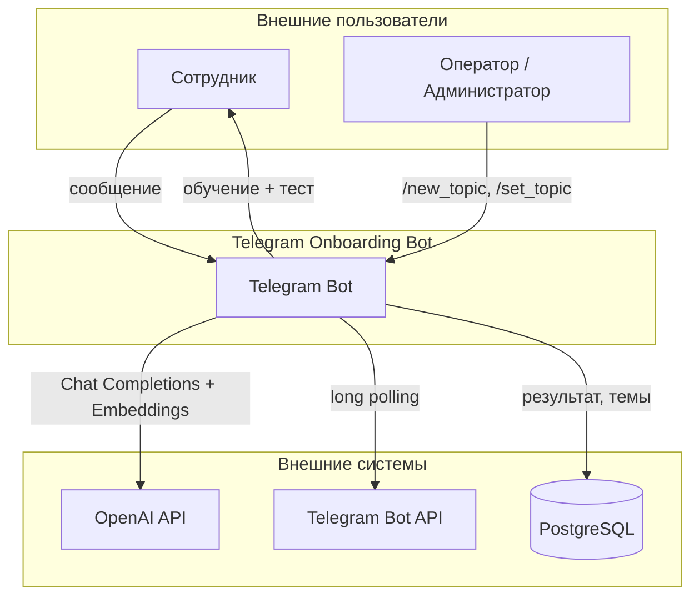
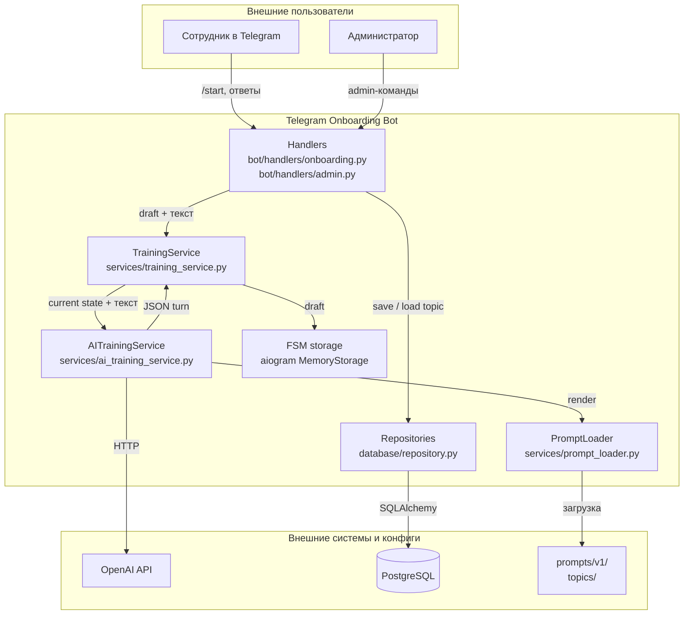
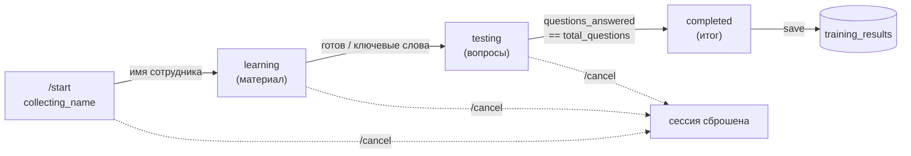

# 🏗️ Telegram Onboarding Bot · ARCHITECTURE

**Проект:** telegram-onboarding-bot
**Дата:** 2026-08-11
**Статус:** as-built после рефакторинга в универсального обучающего бота.

---

## 🎯 1. Архитектурные принципы

Telegram Onboarding Bot — MVP Telegram-бота для первичного обучения и тестирования сотрудников по выбранной теме.

Ключевые принципы:

- **Один сервисный слой оркеструет диалог.** `TrainingService` владеет фазой сессии и счётчиками; LLM только понимает сообщения и генерирует реплики, код решает порядок, оценку и переходы.
- **LLM отвечает за язык, код — за жизненный цикл.** Guard-логика в `TrainingService.apply_ai_turn` не позволяет модели нарушить фазы (регресс `testing → learning`, досрочный финал), даже если JSON-ответ утверждает иное.
- **Промпты и темы внешние и версионированы.** `prompts/<version>/system.md` + `response-schema.json` и `topics/<id>.json` лежат вне кода; активная версия промпта задаётся в конфиге темы (`prompts_version`), редактируется без правки кода.
- **JSON Schema ответа LLM — строгая, валидируется Pydantic.** `TrainingAssistantTurn` со схемой `additionalProperties: false` обязывает модель вернуть предопределённую структуру.
- **Дедупликация вопросов двух уровней.** Ключевые слова и перекрытие слов в `TrainingService._is_duplicate` + embedding-сравнение (косинусная близость ≥ 0.72) в `AITrainingService` — против переформулировок.
- **Сессии в памяти** (`MemoryStorage`); завершённые результаты — в PostgreSQL. Активная тема хранится в БД (`bot_settings`), а не в `.env`.
- **RBAC для админ-команд.** Управление темами доступно только пользователю с `ADMIN_USER_ID`; `/topic` для смены темы пользователем не закрыт (см. «Ограничения»).

---

## 🌐 2. Context Diagram



---

## 📦 3. Container Diagram



---

## 🧩 4. Состав компонентов

| Компонент | Файл | Назначение |
|-----------|------|------------|
| Точка входа | `main.py` | Логирование, инициализация БД, восстановление активной темы, запуск polling |
| Обработчики | `bot/handlers/onboarding.py` | `/start`, `/topic`, `/cancel`, FSM-сессия, guard-fallback |
| Админ-роутер | `bot/handlers/admin.py` | `/admin`, `/new_topic`, `/import_topic`, `/list_topics`, `/set_topic`, `/delete_topic` (RBAC) |
| Клавиатуры | `bot/keyboards/common.py` | Reply-клавиатура «Отмена», удаление клавиатуры |
| Middleware | `bot/middlewares/logging.py` | Логирование входящих сообщений |
| Конфигурация | `config/settings.py` | Pydantic-settings из `.env` |
| Сервис сессии | `services/training_service.py` | Бизнес-логика: фазы, оценка, дедупликация, подсчёт, guard-логика, сохранение |
| AI-сервис | `services/ai_training_service.py` | HTTP-клиент OpenAI (Chat Completions + Embeddings), дедупликация по смыслу |
| Загрузчик промптов | `services/prompt_loader.py` | Загрузка и рендеринг версионированных промптов и JSON Schema |
| Модели БД | `database/models.py` | `TrainingResult`, `TrainingTopic`, `BotSettings` |
| Репозитории | `database/repository.py` | `TrainingResultRepository`, `TrainingTopicRepository`, `BotSettingsRepository` |
| Схемы | `schemas/training.py` | `TrainingTopicConfig`, `TrainingSessionDraft`, `TrainingAssistantTurn`, `LLMContext` |
| Инициализация БД | `database/db.py` | Async engine, session factory, `init_db` |

---

## 🔄 5. Поток данных

### 5.1. Старт сессии

- Сотрудник отправляет `/start`.
- `handle_start` через `_ensure_topic_config` загружает активную тему из PostgreSQL **до** входа в FSM-состояние. Если активной темы нет — бот отвечает подсказкой (`/import_topic`/`/new_topic` или `/set_topic <id>`) и не начинает сессию.
- При наличии темы устанавливается `TrainingStates.active`, `TrainingService.start_session` создаёт пустой `TrainingSessionDraft` (`phase=collecting_name`) и сохраняет его в FSM-данных.
- Бот отвечает приветствием и просит имя сотрудника.

### 5.2. Ход диалога

- Текстовое сообщение попадает в `process_ai_training` (фильтр `TrainingStates.active, F.text`).
- Если имя ещё не собрано — `register_employee_name` переводит `phase` в `learning`, и делается первый ход LLM с нейтральным сообщением (чтобы имя не содержало ключевых слов готовности).
- Иначе `AITrainingService.generate_turn` отправляет в OpenAI Chat Completions системный промпт (рендеренный под тему) + компактный контекст (`LLMContext`) + сообщение сотрудника; ответ валидируется как `TrainingAssistantTurn`.
- `TrainingService.apply_ai_turn` применяет guard-логику: оценка ответа (только в `testing` при наличии `current_question`), определение следующего вопроса (`next_question` → fallback к извлечению из `reply`), отбрасывание дубликатов, пересчёт `questions_answered` из списка `asked_questions`.
- В фазе `testing` выполняется embedding-проверка на семантический дубликат (косинус ≥ 0.72); при дубликате `current_question` сбрасывается.
- Если после этого в `testing` нет валидного вопроса — срабатывает guard-fallback (раздел 7).
- Обновлённый `draft` сохраняется в FSM, бот отправляет `_format_bot_reply`.

### 5.3. Завершение и сохранение

- При `phase == "completed"` вызывается `_send_final_result`.
- `TrainingService.ensure_summary` гарантирует наличие `final_summary` (при отсутствии — дополнительный ход LLM `generate_summary`).
- `TrainingService.create_result` → `TrainingResultRepository.create` сохраняет запись в `training_results`.
- FSM-состояние очищается, бот отправляет итог, балл и лог ходов с расходом токенов.

---

## 🔁 6. Жизненный цикл сессии

В aiogram FSM используется одно состояние — `TrainingStates.active`. Фаза диалога хранится не в состояниях FSM, а в `TrainingSessionDraft.phase`:



Переход `learning → testing` управляется как сигналом модели (`ai_turn.phase == "testing"`), так и ключевыми словами сотрудника (`готов`, `тест`, `давай`, `экзамен` и др.). Переход в `completed` разрешён только при `questions_answered == total_questions`.

---

## 🛡️ 7. Guard-логика и дедупликация

### 7.1. Строгий контроль фаз

`TrainingService.apply_ai_turn` не позволяет:
- вернуться из `testing` в `learning` (регресс фазы блокируется по порядку фаз);
- завершить сессию (`completed`), пока не задано `total_questions` уникальных вопросов;
- модели задать «вопрос N+1» после достижения лимита (hard cap переводит в `completed` и сбрасывает `current_question`).

### 7.2. Уникальность вопросов (два уровня)

- **Лексический:** `TrainingService._is_duplicate` нормализует вопрос (убирает слова «следующий/первый/…», пунктуацию) и сравнивает по точному совпадению и перекрытию слов (≥ 2 общих слова, ≥ 50% от уже заданного).
- **Семантический:** `AITrainingService.is_semantic_duplicate` сравнивает embedding нового вопроса с embeddings заданных (косинусная близость, порог 0.72). Embeddinganswered вопроса сохраняется в `asked_questions_embeddings` и переиспользуется — без повторной оплаты API.

### 7.3. Guard-fallback (подбор вопроса)

Если в фазе `testing` нет валидного `current_question` (`should_request_question` истинно) — из-за дубликата, отсутствия `next_question` или некорректного ответа — срабатывает цикл до 3 попыток:

- `AITrainingService.request_question` делает дополнительный ход LLM с явным требованием «задай следующий вопрос, не повторяющий заданные по смыслу»;
- результат проходит повторную embedding-проверку на дубликат;
- обратная связь по последнему ответу сохраняется и показывается сотруднику вместе с новым вопросом.

Это guard от некорректных ответов модели, а не retry при сбое OpenAI API (см. раздел 10).

### 7.4. Корректность оценки

Оценка (`latest_answer_evaluated`) учитывается только в фазе `testing` и только при наличии текущего вопроса. `questions_answered` всегда равен `len(asked_questions)` — счётчик пересчитывается из списка уникальных вопросов, а не инкрементируется моделью.

---

## 📐 8. Модели данных

### 8.1. PostgreSQL-таблицы

**`training_results`** — итог обучения:

| Поле | Тип | Описание |
|------|-----|----------|
| `id` | `Integer` PK | Идентификатор |
| `employee_name` | `String(255)` | Имя сотрудника |
| `telegram_user_id` | `BigInteger`, index | ID пользователя Telegram |
| `telegram_chat_id` | `BigInteger`, index | ID чата |
| `topic` | `String(255)` | Название темы |
| `total_questions` | `Integer` | Всего вопросов |
| `correct_answers` | `Integer` | Правильных ответов |
| `score_percent` | `Integer` | Процент |
| `final_summary` | `Text` \| null | Итоговый комментарий LLM |
| `total_tokens_spent` | `Integer` | Расход токенов за сессию |
| `created_at` | `DateTime(tz)` | Время создания |

**`training_topics`** — темы обучения:

| Поле | Тип | Описание |
|------|-----|----------|
| `id` | `String(64)` PK | Идентификатор темы |
| `name` | `String(255)` | Название |
| `description` | `Text` \| null | Описание |
| `material` | `Text` | Материал для обучения |
| `prompts_version` | `String(32)` | Версия промпта (`v1`) |
| `created_at` / `updated_at` | `DateTime(tz)` | Метки времени |

**`bot_settings`** — глобальные настройки бота:

| Поле | Тип | Описание |
|------|-----|----------|
| `id` | `Integer` PK | Идентификатор |
| `active_topic_id` | `String(64)` \| null | Активная тема (глобально) |
| `updated_at` | `DateTime(tz)` | Время обновления |

### 8.2. In-memory: `TrainingSessionDraft`

Состояние активной сессии в FSM (`MemoryStorage`):

| Поле | Тип | Описание |
|------|-----|----------|
| `employee_name` | `str` \| null | Имя сотрудника |
| `phase` | `Literal` | `collecting_name` / `learning` / `testing` / `completed` |
| `total_questions` | `int` | Плановое число вопросов |
| `questions_answered` | `int` | = `len(asked_questions)` (пересчёт) |
| `correct_answers` | `int` | Правильных ответов |
| `current_question` | `str` \| null | Текущий вопрос |
| `current_question_embedding` | `list[float]` \| null | Embedding текущего вопроса |
| `asked_questions` | `list[str]` | Заданные вопросы |
| `asked_questions_embeddings` | `list[list[float]]` | Их embeddings (для дедупликации) |
| `last_answer_feedback` | `str` \| null | Обратная связь по последнему ответу |
| `final_summary` | `str` \| null | Итоговая сводка |
| `total_tokens_spent` | `int` | Расход токенов |
| `turns_log` | `list[TrainingTurnLogEntry]` | Лог ходов (фаза, превью, токены) |

### 8.3. Контракт ответа LLM: `TrainingAssistantTurn`

| Поле | Тип | Описание |
|------|-----|----------|
| `reply` | `str` | Текст, видимый сотруднику |
| `phase` | `Literal` | `learning` / `testing` / `completed` |
| `latest_answer_evaluated` | `bool` | Оценён ли ответ в этом ходу |
| `answer_is_correct` | `bool` \| null | Правильность (с `latest_answer_evaluated`) |
| `answer_feedback` | `str` \| null | Обратная связь |
| `next_question` | `str` \| null | Техническая копия вопроса |
| `final_summary` | `str` \| null | Итог (при `completed`) |
| `prompt_tokens` / `completion_tokens` / `total_tokens` | `int` | Расход токенов |

Компактный контекст, передаваемый в промпт, — `LLMContext` (без embeddings и `turns_log`).

---

## 📨 9. JSON Schema ответа LLM

Полная схема — в [`prompts/v1/response-schema.json`](../prompts/v1/response-schema.json), strict-режим (`additionalProperties: false`):

```json
{
  "reply": "string",
  "phase": "learning | testing | completed",
  "latest_answer_evaluated": true | false,
  "answer_is_correct": true | false | null,
  "answer_feedback": "string | null",
  "next_question": "string | null",
  "final_summary": "string | null"
}
```

Поведенческие правила модели — в [`prompts/v1/system.md`](../prompts/v1/system.md) (пользовательский слой промпта); технический слой (JSON-контракт, переходы фаз, требование `next_question`) собирается в коде `_build_prompt()`. Подробнее — в [`docs/PROMPT_ARCHITECTURE.md`](PROMPT_ARCHITECTURE.md). Примеры ответов по фазам — в [`docs/examples/`](examples/).

---

## 🚨 10. Обработка ошибок и fallback

### 10.1. Обработка в обработчиках

- `except ValueError` в `process_ai_training` — показывает сообщение ошибки пользователю (например, «Укажите имя сотрудника хотя бы из двух символов»).
- `except Exception` — логирует traceback и отвечает общим сообщением «Не удалось обработать сообщение. Попробуйте еще раз или отправьте /cancel».
- Неподдерживаемые типы сообщений (голосовые, файлы, стикеры) — отдельный роутер просит ответить текстом.

### 10.2. HTTP-вызовы OpenAI

- `httpx.AsyncClient` с таймаутом 120 с (connect — 30 с).
- `response.raise_for_status()` бросает исключение на HTTP-ошибках (4xx/5xx), которое ловится на уровне handler как общая ошибка. **Явного retry на 429/5xx нет** — в отличие от ботов с устойчивым fallback на уровне сервиса, здесь отказ API прерывает ход диалога и требует повторной отправки сообщения сотрудником.

### 10.3. Fallback от некорректных ответов модели (guard)

Не путать с retry при сбое API — это устойчивость к плохим ответам модели:

- **Подбор вопроса** — guard-fallback (раздел 7.3) до 3 попыток.
- **Итоговая сводка** — `ensure_summary` делает дополнительный ход `generate_summary`, если модель не вернула `final_summary` при завершении.
- **Извлечение вопроса из `reply`** — если `next_question` пустой/некорректный, вопрос пытаемся извлечь из `reply` по знаку вопроса.

### 10.4. Единственный источник тем — БД

Единственный runtime-источник тем — PostgreSQL (`training_topics`). Каталог `topics/*.json` — это **импортные шаблоны**, загружаемые в БД командой администратора `/import_topic` (через `create_or_update`, с перезаписью всех полей включая `prompts_version`). Бот не читает `topics/` автоматически при старте.

При запуске `main.py` не выполняет сидинга. Бот стартует при любой состоянии БД (включая пустую) и без каталога `topics/`. Алгоритм старта:

- загрузить список id тем из `training_topics`;
- определить активную тему: значение из `bot_settings` имеет приоритет над `.env ACTIVE_TOPIC` (последний — только first-start hint);
- если выбранная тема не найдена в БД — сбросить её (`bot_settings.active_topic_id = None` для DB-значения, `settings.active_topic_id = None` для `.env`) с предупреждением в лог, не падать.

`/start` без активной темы не падает: если в БД нет тем — подсказка `/import_topic` или `/new_topic`; если темы есть, но активная не выбрана — подсказка `/set_topic <id>`. FSM-состояние `active` не устанавливается, пока тема не подтверждена.

Результаты обучения (`training_results.topic` — свободная строка без FK) не удаляются при удалении темы; `/delete_topic` сообщает число сохранённых результатов.

---

## ⚠️ 11. Ограничения и следующие шаги

- **Сессии в памяти.** Прогресс активной сессии теряется при перезапуске бота. Для продакшена — Redis/PostgreSQL-хранилище FSM.
- **Нет retry при сбое OpenAI API.** Временная недоступность API прерывает ход диалога. Стоит добавить retry на 429/5xx с экспоненциальной задержкой.
- **`/topic <id>` не закрыт RBAC.** Любой пользователь меняет глобальную активную тему для всех. См. [`docs/SECURITY_NOTES.md`](SECURITY_NOTES.md).
- **Один активный оператор.** `ADMIN_USER_ID` — единственный администратор; нет ролевой модели.
- **Нет аудита** всех сообщений и ошибок в постоянное хранилище.
- **Abstraction LLM-провайдера.** OpenAI захардкожен; замена требует обобщения `AITrainingService`.
- Для production — health endpoint, мониторинг, graceful shutdown.

---

## 📚 Связанные документы

- [🏠 `README.md`](../README.md) — главная страница проекта.
- [📝 `docs/PROMPT_ARCHITECTURE.md`](PROMPT_ARCHITECTURE.md) — двухслойная архитектура промпта.
- [🔌 `docs/API_CONTRACT.md`](API_CONTRACT.md) — контракты OpenAI / Telegram Bot API / LLM-хода.
- [🧪 `docs/TESTING.md`](TESTING.md) — результаты E2E-прогонов и дефекты.
- [🎬 `docs/E2E_SCENARIOS.md`](E2E_SCENARIOS.md) — сквозные сценарии.
- [🚀 `docs/DEPLOYMENT_GUIDE.md`](DEPLOYMENT_GUIDE.md) — развёртывание с нуля.
- [🔐 `docs/SECURITY_NOTES.md`](SECURITY_NOTES.md) — безопасность, RBAC, персональные данные.
- [📋 `docs/IMPLEMENTATION_PLAN.md`](IMPLEMENTATION_PLAN.md) — план реализации.
- [📊 `docs/PROJECT_STATE.md`](PROJECT_STATE.md) — паспорт состояния проекта.