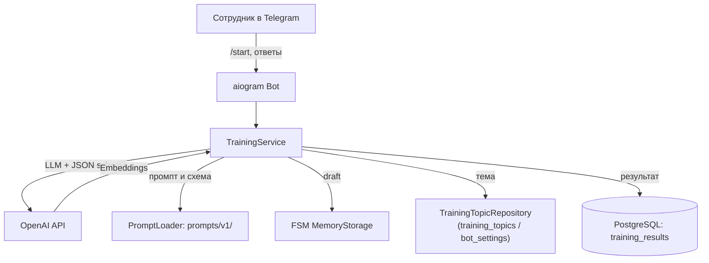

# 📋 Telegram Onboarding Bot · IMPLEMENTATION_PLAN

**Проект:** telegram-onboarding-bot
**Дата:** 2026-08-11
**Статус:** as-built. Универсальная архитектура тем и промптов реализована, E2E-дефекты устранены и подтверждены прогонами. До публикации остаётся Deployment Validation в чистом окружении.

---

## 🎯 1. Архитектура решения

---

## 🧩 2. Состав компонентов

| Компонент | Файл | Назначение |
|-----------|------|------------|
| Точка входа | `main.py` | Запуск бота, инициализация БД, сидинг тем из `topics/`, восстановление активной темы |
| Обработчики | `bot/handlers/onboarding.py` | `/start`, `/topic`, `/cancel`, FSM-сессия, guard-fallback, semantic-dedup |
| Админ-роутер | `bot/handlers/admin.py` | `/new_topic`, `/list_topics`, `/set_topic`, `/delete_topic` (RBAC по `ADMIN_USER_ID`) |
| Клавиатуры | `bot/keyboards/common.py` | Reply-клавиатура «Отмена», удаление клавиатуры |
| Middleware | `bot/middlewares/logging.py` | Логирование входящих сообщений |
| Конфигурация | `config/settings.py` | Pydantic-settings из `.env` |
| Схемы | `schemas/training.py` | `TrainingTopicConfig`, `TrainingSessionDraft`, `TrainingAssistantTurn`, `LLMContext` |
| Сервис сессии | `services/training_service.py` | Бизнес-логика: фазы, оценка, дедупликация, guard-логика, подсчёт, сохранение |
| AI-сервис | `services/ai_training_service.py` | HTTP-клиент OpenAI (Chat Completions + Embeddings), дедупликация по смыслу, guard-fallback |
| Загрузчик промптов | `services/prompt_loader.py` | Загрузка и рендеринг версионированных промптов и JSON Schema |
| Модели БД | `database/models.py` | `TrainingResult`, `TrainingTopic`, `BotSettings` |
| Репозитории | `database/repository.py` | CRUD результатов, тем, настроек |
| Инициализация БД | `database/db.py` | Async engine, session factory, `init_db` |

---

## 📐 3. Модель данных

### 3.1. `training_results` — итог обучения

| Поле | Тип | Описание |
|------|-----|----------|
| `id` | `Integer` PK | Идентификатор |
| `employee_name` | `String(255)` | Имя сотрудника |
| `telegram_user_id` | `BigInteger` | ID пользователя Telegram |
| `telegram_chat_id` | `BigInteger` | ID чата |
| `topic` | `String(255)` | Название темы |
| `total_questions` | `Integer` | Всего вопросов |
| `correct_answers` | `Integer` | Правильных ответов |
| `score_percent` | `Integer` | Процент |
| `final_summary` | `Text` \| null | Итоговый комментарий LLM |
| `total_tokens_spent` | `Integer` | Расход токенов за сессию |
| `created_at` | `DateTime(tz)` | Время создания |

### 3.2. `training_topics` — темы обучения

| Поле | Тип | Описание |
|------|-----|----------|
| `id` | `String(64)` PK | Идентификатор темы |
| `name` | `String(255)` | Название |
| `description` | `Text` \| null | Описание |
| `material` | `Text` | Материал для обучения |
| `prompts_version` | `String(32)` | Версия промпта (`v1`) |
| `created_at` / `updated_at` | `DateTime(tz)` | Метки времени |

### 3.3. `bot_settings` — глобальные настройки

| Поле | Тип | Описание |
|------|-----|----------|
| `id` | `Integer` PK | Идентификатор |
| `active_topic_id` | `String(64)` \| null | Активная тема (глобально) |
| `updated_at` | `DateTime(tz)` | Время обновления |

### 3.4. `TrainingSessionDraft` — состояние сессии (in-memory, FSM)

| Поле | Описание |
|------|----------|
| `employee_name` | Имя сотрудника |
| `phase` | `collecting_name` / `learning` / `testing` / `completed` |
| `total_questions` / `questions_answered` / `correct_answers` | Счётчики |
| `current_question` | Текущий вопрос |
| `asked_questions` | Заданные вопросы (для дедупликации) |
| `last_answer_feedback` | Обратная связь по последнему ответу |
| `final_summary` | Итоговая сводка |
| `total_tokens_spent` | Расход токенов |
| `turns_log` | Лог ходов (фаза, превью, токены) |

---

## 🔌 4. Интеграции

| Система | Тип | Данные |
|---------|-----|--------|
| Telegram Bot API | HTTP long polling | Входящие сообщения и ответы |
| OpenAI API — Chat Completions | HTTP JSON, `response_format=json_schema` | Ход диалога, оценка, переходы фаз |
| OpenAI API — Embeddings | HTTP JSON | Дедупликация вопросов (`text-embedding-3-small`, косинус ≥ 0.72) |
| PostgreSQL | SQLAlchemy 2.x async (asyncpg) | Результаты, темы, настройки |

Полные контракты — в [`docs/API_CONTRACT.md`](API_CONTRACT.md). Внешние интеграции верифицируются по официальной документации OpenAI и Telegram Bot API.

---

## 📅 5. План реализации

### 5.1. Этап 1 · Подготовка окружения

- Создать `.env` на основе `.env.example`.
- Получить `BOT_TOKEN` через [@BotFather](https://t.me/botfather).
- Подготовить `OPENAI_API_KEY` и модель в аккаунте.
- Указать `ADMIN_USER_ID` (Telegram user ID администратора).
- Задать `ACTIVE_TOPIC` (id темы-заготовки из `topics/`) — начальная активная тема.

### 5.2. Этап 2 · Локальная проверка

- `docker compose up --build`.
- Проверить логи: `Start polling for bot @<your_bot>`.
- Пройти сценарий `/start` → имя → обучение → тест → итог в PostgreSQL.
- Проверить сохранение: `SELECT count(*) FROM training_results;`.

### 5.3. Этап 3 · Развёртывание на VPS

- Подключиться по SSH, установить Docker и плагин Compose.
- Клонировать репозиторий, заполнить `.env`.
- `docker compose up --build -d`.
- Проверить статус и логи.

### 5.4. Этап 4 · Управление темами

- Добавить новую тему через `/new_topic` (администратор) или файл `topics/<id>.json` + рестарт.
- Активировать тему: `/set_topic <id>` (на работающей системе) или `ACTIVE_TOPIC` в `.env` (при первом старте).
- Подробно — [`docs/OPERATOR_GUIDE.md`](OPERATOR_GUIDE.md).

### 5.5. Этап 5 · Подготовка документации

- `README.md`, `ARCHITECTURE.md`, `PROMPT_ARCHITECTURE.md`, `API_CONTRACT.md`.
- `DEPLOYMENT_GUIDE.md`, `USER_GUIDE.md`, `OPERATOR_GUIDE.md`, `SECURITY_NOTES.md`.
- `E2E_SCENARIOS.md`, `SYSTEM_DEMO.md`, `BUSINESS_VALUE.md`, `TESTING.md`.
- `examples/` — JSON-контракты LLM-хода по фазам.

---

## ✅ 6. Критерии готовности

### Функциональные

- [x] Проект запускается через `docker compose up --build` без ошибок.
- [x] Бот проходит сценарий `/start` → имя → обучение → тест → результат в PostgreSQL.
- [x] Подсчёт `correct_answers` корректен (подтверждено прогонами 5/5, 4/5, 2/5, 1/5).
- [x] `total_tokens_spent` сохраняется в PostgreSQL (F8 устранён).
- [x] Нет дублирования вопросов — лексическая + embedding-дедупликация, порог 0.72 (D1/F2/F11 устранены).
- [x] Чёткий переход к `testing` по сигналу готовности (F5/F9 устранены).
- [x] Корректное завершение после `total_questions` — без лишнего N+1 вопроса (F3/F10 устранены).
- [x] Имя сотрудника с ключевыми словами не запускает тест сразу (F7 устранён).
- [x] Feedback по ответу не пропадает при guard-fallback.

### Архитектурные

- [x] Единая точка входа `main.py` (F4 устранён — `bot/main.py` не нужен).
- [x] Промпты вынесены из хардкода: `prompts/v1/system.md` + `response-schema.json` + `prompt_loader.py`.
- [x] Двухслойный промпт: пользовательский слой (`system.md`, без имён JSON-полей) + технический слой (`_build_prompt()` в коде).
- [x] Универсальные темы: `topics/<id>.json` + `training_topics` в БД + админка с RBAC.
- [x] Guard-логика фаз в `TrainingService.apply_ai_turn` (no regression, hard cap, пересчёт счётчика).
- [x] Guard-fallback: `request_question()` / `generate_summary()` / `ensure_summary()`.
- [x] Публичный GitHub-репозиторий с самодостаточной документацией.

### Не закрыто

- [ ] Retry/fallback при недоступности OpenAI API (сейчас HTTP-ошибки прерывают ход диалога).
- [ ] Персистентное FSM-хранилище (Redis/PostgreSQL) — сессии в памяти.
- [ ] `/topic <id>` закрыт RBAC (сейчас любой пользователь меняет глобальную тему).
- [ ] Deployment Validation в чистом окружении — критерий готовности к публикации по стандарту APL.

Подробнее о статусах дефектов — в [`docs/TESTING.md`](TESTING.md) (сводная таблица).

---

## 📚 Связанные документы

- [🏠 `README.md`](../README.md) — главная страница проекта.
- [🏗️ `docs/ARCHITECTURE.md`](ARCHITECTURE.md) — архитектура системы.
- [📝 `docs/PROMPT_ARCHITECTURE.md`](PROMPT_ARCHITECTURE.md) — двухслойная архитектура промпта.
- [🔌 `docs/API_CONTRACT.md`](API_CONTRACT.md) — контракты интеграций.
- [🚀 `docs/DEPLOYMENT_GUIDE.md`](DEPLOYMENT_GUIDE.md) — развёртывание с нуля.
- [🎛️ `docs/OPERATOR_GUIDE.md`](OPERATOR_GUIDE.md) — управление темами.
- [🧪 `docs/TESTING.md`](TESTING.md) — результаты E2E-прогонов и дефекты.
- [📊 `docs/PROJECT_STATE.md`](PROJECT_STATE.md) — паспорт состояния проекта.