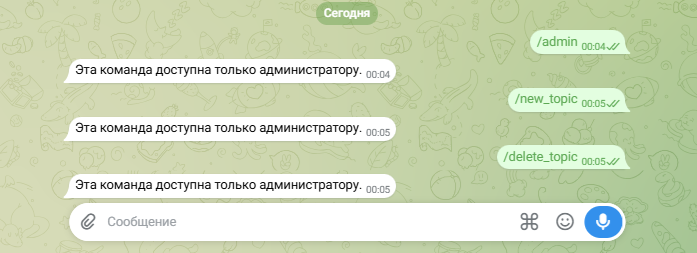
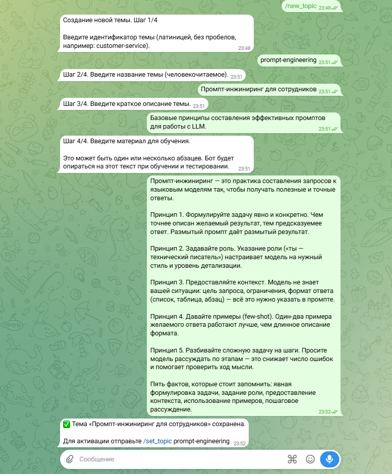
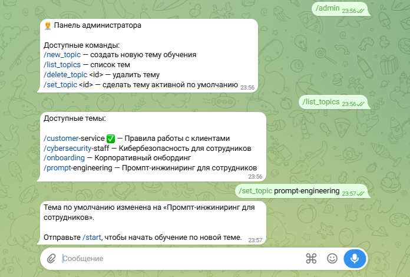
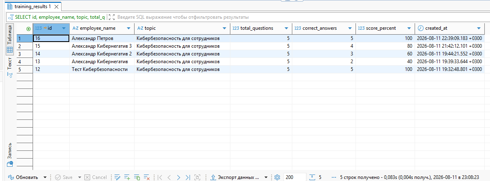

# 🎛️ Telegram Onboarding Bot · OPERATOR_GUIDE

**Проект:** telegram-onboarding-bot
**Дата:** 2026-08-11
**Статус:** Руководство оператора/администратора, управляющего темами обучения.

> 📌 **SOT:** Сценарии описаны по фактической реализации бота
> (`bot/handlers/admin.py`, `bot/handlers/onboarding.py`). Если поведение
> бота расходится с этим руководством — исправляется руководство.

---

## 🎯 1. Для кого

Для **оператора/администратора**, который управляет темами обучения и
просматривает результаты. Руководство сотрудника, проходящего обучение, —
отдельным документом: [📖 `USER_GUIDE.md`](USER_GUIDE.md).

---

## 🔐 2. Доступ

Админ-команды доступны только пользователю с Telegram ID, указанным в
`ADMIN_USER_ID` в `.env`. Проверка: `message.from_user.id == ADMIN_USER_ID`.
Если переменная не задана — админ-команды отключены. Узнать свой Telegram ID
можно у бота `@userinfobot`.

> ⚠️ Команды от не-администратора отклоняются сообщением «Эта команда доступна
> только администратору». См. [🔐 `SECURITY_NOTES.md`](SECURITY_NOTES.md).



---

## 🗂️ 3. Управление темами

| Команда | Назначение |
|---------|------------|
| `/admin` | Показать меню администратора |
| `/new_topic` | Создать тему по шагам в диалоге: id, название, описание, материал |
| `/list_topics` | Список тем, активная отмечена |
| `/set_topic <id>` | Сделать тему активной по умолчанию |
| `/delete_topic <id>` | Удалить тему |

### 3.1. Создание темы через `/new_topic`

Пошаговый FSM-диалог:

1. `/new_topic` → бот запрашивает **id** (kebab-case, латиница, без пробелов).
2. Вводите **название** — отображается сотруднику.
3. Вводите **описание** — кратко, 1–2 строки.
4. Вводите **материал** — обучающий текст, из которого бот строит обучение
   и вопросы. Рекомендуется 5–7 discrete фактов под тест из 5 вопросов.
5. Бот отвечает «✅ Тема сохранена. Для активации отправьте /set_topic <id>».

Тема сохраняется в PostgreSQL (`training_topics`) и сразу доступна для
обучения после активации.



### 3.2. Активная тема

- `/set_topic <id>` делает тему активной по умолчанию — все новые сессии
  начинаются с неё.
- Активная тема хранится в `bot_settings` и **восстанавливается после
  пересборки контейнера** — повторно выбирать её не нужно.
- `/list_topics` показывает все темы с отметкой активной.



### 3.3. Удаление темы

`/delete_topic <id>` удаляет тему. Если удаляемая тема была активной, активная
ссылка сбрасывается — нужно назначить новую через `/set_topic`.

---

## 🔀 4. Смена темы пользователем

Команда `/topic` (не админ-команда, доступна всем пользователям):
- без аргументов — список тем;
- `/topic <id>` — переключает тему и сбрасывает текущую сессию пользователя.

> ⚠️ **Побочный эффект:** `/topic <id>` меняет **глобальную** активную тему
> (та же `bot_settings`, что и у `/set_topic`), а не персональный выбор. Любой
> сотрудник, переключая тему себе, меняет тему по умолчанию для всех новых
> сессий. Это поведение MVP для маленькой команды. Если требуется ограничить —
> см. открытый вопрос в
> [📋 `IMPLEMENTATION_PLAN.md`](IMPLEMENTATION_PLAN.md).


---

## 💾 5. Просмотр результатов

Результаты хранятся в PostgreSQL, таблица `training_results`. Подключение —
см. [🚀 `DEPLOYMENT_GUIDE.md`](DEPLOYMENT_GUIDE.md), раздел «Проверка базы
данных». Записи содержат: имя сотрудника, тему, количество вопросов, число
правильных ответов, процент, итоговую сводку и число потраченных токенов.

Пример запроса последних сессий:

```bash
docker compose exec db psql -U postgres -d onboarding -c \
  "SELECT id, employee_name, topic, total_questions, correct_answers, score_percent, created_at
   FROM training_results ORDER BY id DESC LIMIT 5;"
```



---

## 📝 6. Добавление темы вручную (без диалога)

Альтернатива `/new_topic` — файл темы-заготовки напрямую. Тема сохранится в БД при следующем старте бота (сидирование идемпотентно: существующие id пропускаются, новые создаются).

1. Создайте `topics/<id>.json`:

```json
{
  "id": "my-topic",
  "name": "Моя тема",
  "description": "Краткое описание",
  "material": "Материал для обучения...",
  "prompts_version": "v1"
}
```

2. Перезапустите бот, чтобы тема засидировалась в БД:

```bash
docker compose restart bot
```

3. Активируйте тему:
   - **на работающей системе** — `/set_topic my-topic` (рекомендуется);
   - **при первом старте**, пока в БД нет активной темы, — `ACTIVE_TOPIC=my-topic` в `.env`.

> ⚠️ `ACTIVE_TOPIC` в `.env` **не** меняет тему на работающей системе, где в БД уже есть активная тема (`bot_settings`): при рестарте `main.py` перезаписывает активную тему из БД. Для смены используйте `/set_topic`.
>
> ⚠️ Правка `topics/<id>.json` для **уже существующей** в БД темы не обновит её — сидирование пропускает имеющиеся id. Чтобы обновить существующую тему через файл, сначала удалите её из БД (`/delete_topic <id>`), затем правьте файл и перезапускайте. Сменить `prompts_version` у существующей темы — см. [🧩 `docs/PROMPT_ARCHITECTURE.md`](PROMPT_ARCHITECTURE.md), раздел 10.

Подробнее — в [🚀 `DEPLOYMENT_GUIDE.md`](DEPLOYMENT_GUIDE.md).

---

## 📚 7. Связанные документы

- [🏠 `README.md`](../README.md) — назначение проекта и быстрый старт.
- [📖 `docs/USER_GUIDE.md`](USER_GUIDE.md) — как пройти обучение сотруднику.
- [🎬 `docs/SYSTEM_DEMO.md`](SYSTEM_DEMO.md) — скриншоты и примеры диалогов.
- [🚀 `docs/DEPLOYMENT_GUIDE.md`](DEPLOYMENT_GUIDE.md) — запуск, env vars, подключение к БД.
- [🔐 `docs/SECURITY_NOTES.md`](SECURITY_NOTES.md) — секреты, RBAC, персональные данные.
- [📋 `docs/IMPLEMENTATION_PLAN.md`](IMPLEMENTATION_PLAN.md) — технический план.
- [🧪 `docs/TESTING.md`](TESTING.md) — результаты тестирования.