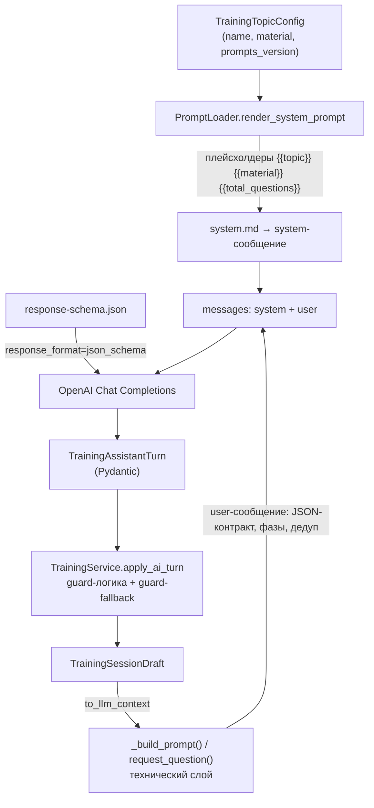

# 🧩 Telegram Onboarding Bot · PROMPT_ARCHITECTURE

**Проект:** telegram-onboarding-bot
**Активная версия промптов:** v1
**Дата актуализации:** 2026-08-11
**Статус:** as-built

---

## 🎯 1. Назначение

Документ фиксирует архитектуру промптов LLM-наставника Telegram Onboarding Bot. Промпты хранятся в `prompts/` в виде версионированных файлов и загружаются кодом из `services/prompt_loader.py`. Тема обучения и поведение модели задаются внешними файлами, а не кодом, — это позволяет адаптировать бота под новую предметную область без изменения Python-кода.

Управление темами (добавление, активация, удаление) — операторское действие и описано в [🎛️ `OPERATOR_GUIDE.md`](OPERATOR_GUIDE.md) и [🚀 `DEPLOYMENT_GUIDE.md`](DEPLOYMENT_GUIDE.md); здесь — только архитектура промпта.

---

## 🧩 2. Структура запроса к LLM



---

## 📂 3. Хранение и версионирование промптов

```text
prompts/
└── v1/
    ├── system.md            # Системный промпт с плейсхолдерами (пользовательский слой)
    └── response-schema.json # JSON Schema для structured output
```

| Файл | Версия | Статус | Описание |
|------|--------|--------|----------|
| [📄 `prompts/v1/system.md`](../prompts/v1/system.md) | v1 | **Активная** | Поведенческие правила AI-наставника, без имён JSON-полей |
| [📄 `prompts/v1/response-schema.json`](../prompts/v1/response-schema.json) | v1 | **Активная** | Контракт ответа LLM (`response_format=json_schema`) |

### Правило изменений

1. Новая версия — новый каталог `prompts/<version>/`.
2. Предыдущая версия сохраняется.
3. В конфигах тем, которые должны использовать новую версию, меняется `prompts_version`.
4. После изменения выполняется E2E-прогон и фиксируются результаты в [🧪 `docs/TESTING.md`](TESTING.md).

---

## 🧱 4. Двухслойная архитектура промпта

Промпт разделён на два слоя ответственности. Это ключевое архитектурное решение: пользовательский слой редактируется нетехническим специалистом, технический слой принадлежит коду.

### 4.1. Пользовательский слой — `prompts/v1/system.md`

Описывает только роль и поведение, без технических деталей:

- роль AI-наставника в Telegram;
- тему и материал, подставляемые из конфига темы;
- формат работы (обучение → тест → итог);
- поведенческие правила: объясни материал → спроси готовность → по сигналу перейди к тесту → задавай по одному вопросу → не повторяй факты по смыслу → дай итог;
- запреты (не придумывать факты вне материала, не отвечать за сотрудника, не задавать вопрос дважды, не завершать тест досрочно).

**В `system.md` нет имён JSON-полей, нет `phase=...`, нет `asked_questions`.** Файл редактируется для настройки роли и поведения, не касаясь контракта ответа.

### 4.2. Технический слой — `_build_prompt()` / `request_question()` в коде

В `services/ai_training_service.py` формируется per-turn пользовательское сообщение, которое несёт технический контракт:

- сериализованное текущее состояние сессии через `TrainingSessionDraft.to_llm_context()` (компактный `LLMContext` — без embeddings и `turns_log`);
- правила заполнения JSON-полей ответа (`reply`, `phase`, `latest_answer_evaluated`, `answer_is_correct`, `answer_feedback`, `next_question`, `final_summary`);
- логику переходов между фазами, привязанную к текущему состоянию;
- дедупликацию по `asked_questions` (выбирать факт, ещё не покрытый в сессии).

### 4.3. Плейсхолдеры `system.md`

Рендеринг — `PromptLoader.render_system_prompt()` (`services/prompt_loader.py`), простая замена строк.

| Плейсхолдер | Значение | Источник |
|-------------|----------|----------|
| `{{topic}}` | Название темы | `topic_config.name` |
| `{{material}}` | Материал для обучения | `topic_config.material` |
| `{{total_questions}}` | Число вопросов теста | `settings.quiz_question_count` |

### 4.4. Связь темы с версией промптов

Каждая тема — JSON-файл (`topics/<id>.json`) с полем `prompts_version`, которое связывает тему с конкретной версией промптов:

```json
{
  "id": "onboarding",
  "name": "Корпоративный онбординг",
  "description": "...",
  "material": "...",
  "prompts_version": "v1"
}
```

Одну и ту же версию промптов можно использовать с разными темами — `prompts_version` указывает, какой каталог `prompts/` грузить. Хранилище тем — PostgreSQL (`training_topics`); файлы `topics/*.json` — заготовки, сидируемые в БД при старте. Добавление и активация тем — в [🎛️ `OPERATOR_GUIDE.md`](OPERATOR_GUIDE.md).

---

## 📐 5. JSON Schema ответа

`prompts/v1/response-schema.json` фиксирует контракт ответа LLM и уходит в OpenAI API через `response_format` (`services/ai_training_service.py`) — модель видит структуру ответа отдельно от промпта. Strict-режим (`additionalProperties: false`).

```json
{
  "name": "training_turn",
  "strict": true,
  "schema": {
    "type": "object",
    "properties": {
      "reply": {"type": "string"},
      "phase": {"type": "string", "enum": ["learning", "testing", "completed"]},
      "latest_answer_evaluated": {"type": "boolean"},
      "answer_is_correct": {"type": ["boolean", "null"]},
      "answer_feedback": {"type": ["string", "null"]},
      "next_question": {"type": ["string", "null"]},
      "final_summary": {"type": ["string", "null"]}
    },
    "required": [
      "reply",
      "phase",
      "latest_answer_evaluated",
      "answer_is_correct",
      "answer_feedback",
      "next_question",
      "final_summary"
    ],
    "additionalProperties": false
  }
}
```

Ответ валидируется Pydantic-моделью `TrainingAssistantTurn` (`schemas/training.py`).

---

## 🛡️ 6. Guard-логика и guard-fallback

LLM не всегда строго следует инструкциям, поэтому код подстраховывает поведение модели. Это устойчивость к некорректным ответам модели, а **не** retry при сбое OpenAI API (такого retry нет — см. [🏗️ `ARCHITECTURE.md`](ARCHITECTURE.md), раздел «Обработка ошибок»).

### 6.1. Guard-логика фаз — `TrainingService.apply_ai_turn`

- **Запрет регресса:** модель не может вернуть `phase=learning` из `testing` (фазы упорядочены, регресс блокируется).
- **Hard cap:** при `questions_answered >= total_questions` фаза принудительно переводится в `completed`, `current_question` сбрасывается — модель не задаст «вопрос N+1».
- **Пересчёт счётчика:** `questions_answered` всегда равен `len(asked_questions)`, а не инкрементируется моделью.
- **Оценка только в `testing`:** `latest_answer_evaluated` учитывается только при наличии текущего вопроса.

### 6.2. Guard-fallback — подбор вопроса

Если в фазе `testing` нет валидного `current_question` (дубликат, пустой `next_question`, некорректный ответ) — `should_request_question` истинно и срабатывает цикл до 3 попыток:

- `AITrainingService.request_question` делает дополнительный ход LLM с явным требованием задать следующий неповторяющийся вопрос;
- результат проходит повторную embedding-проверку на дубликат;
- обратная связь по последнему ответу (`last_answer_feedback`) сохраняется и показывается сотруднику вместе с новым вопросом.

### 6.3. Гарантия итоговой сводки — `ensure_summary`

Если модель не вернула `final_summary` при завершении — `TrainingService.ensure_summary` делает дополнительный ход `generate_summary`.

---

## 🛡️ 7. Защита от типичных ошибок LLM

| Проблема | Решение в промпте (`system.md`) | Решение в коде |
|----------|----------------------------------|----------------|
| LLM повторяет вопросы по смыслу | «Вопросы не должны повторяться по смыслу. Выбери факт, ещё не покрытый» | Лексическая дедупликация `_is_duplicate` + embedding (косинус ≥ 0.72, `text-embedding-3-small`) |
| LLM завершает тест досрочно | «Не завершай тест, пока не проверены все N ответов» | Guard: `completed` только при `questions_answered == total_questions`; hard cap |
| LLM возвращается к обучению из теста | — | Guard: запрет регресса фазы в `apply_ai_turn` |
| LLM не возвращает вопрос / `next_question` пуст | «Задавай только один вопрос за раз. Вопрос заканчивается знаком вопроса» | Guard-fallback `request_question` (до 3 попыток); извлечение вопроса из `reply` по «?» |
| LLM не возвращает `final_summary` при завершении | «Дай краткий итог: сильные стороны и что повторить» | `ensure_summary` → `generate_summary` (дополнительный ход) |
| Имя с ключевым словом запускает тест сразу | — | Первый ход после имени делается с нейтральным сообщением; `wants_to_start_test` срабатывает только из ответов сотрудника |
| LLM возвращает невалидный `phase`/`answer_is_correct` | `enum` фаз в JSON Schema | Pydantic-валидация `TrainingAssistantTurn`; guard приводит `phase` к текущей |

---

## 📁 8. Расположение в коде

| Артефакт | Файл |
|----------|------|
| Пользовательский промпт | `prompts/v1/system.md` |
| JSON Schema ответа | `prompts/v1/response-schema.json` |
| Загрузка и рендеринг промпта | `services/prompt_loader.py` |
| Технический слой (`_build_prompt`, `request_question`) | `services/ai_training_service.py` |
| Вызов OpenAI + `response_format` | `services/ai_training_service.py` |
| Конфиг темы (`prompts_version`) | `schemas/training.py` (`TrainingTopicConfig`) |
| Компактный LLM-контекст | `schemas/training.py` (`to_llm_context`) |
| Guard-логика фаз + guard-fallback | `services/training_service.py` |
| Валидация ответа LLM | `schemas/training.py` (`TrainingAssistantTurn`) |

**Правило правок:** поведенческое правило идёт в `system.md`; всё, что ссылается на поля JSON или динамическое состояние draft (`asked_questions`, `phase`, `questions_answered`), — в `_build_prompt()` / `request_question()`.

---

## 📜 9. История изменений

| Дата | Версия | Изменения |
|------|--------|-----------|
| 2026-08-11 | v1 | Первоначальная версия: двухслойная архитектура (`system.md` без имён JSON-полей + технический слой в коде), JSON Schema ответа, embedding-дедупликация, guard-логика фаз, guard-fallback. |

---

## 🆕 10. Как добавить новую версию промптов

1. Скопировать `prompts/v1/` в `prompts/v2/`.
2. Внести изменения в `system.md` и/или `response-schema.json`.
3. В конфигах тем, которые должны использовать новую версию, изменить `prompts_version` на `v2` (для тем в БД — пересоздать тему или изменить через `/new_topic`).
4. Протестировать E2E и зафиксировать результаты в [🧪 `docs/TESTING.md`](TESTING.md).

---

## 📚 Связанные документы

- [🏠 `README.md`](../README.md) — главная страница проекта.
- [🏗️ `docs/ARCHITECTURE.md`](ARCHITECTURE.md) — общая архитектура системы.
- [🔌 `docs/API_CONTRACT.md`](API_CONTRACT.md) — контракты OpenAI / Telegram Bot API / LLM-хода.
- [🎛️ `docs/OPERATOR_GUIDE.md`](OPERATOR_GUIDE.md) — управление темами (добавление, активация).
- [🚀 `docs/DEPLOYMENT_GUIDE.md`](DEPLOYMENT_GUIDE.md) — поставка и активация тем при развёртывании.
- [🧪 `docs/TESTING.md`](TESTING.md) — результаты E2E-прогонов.
- [📋 `docs/IMPLEMENTATION_PLAN.md`](IMPLEMENTATION_PLAN.md) — план реализации.
- [📊 `docs/PROJECT_STATE.md`](PROJECT_STATE.md) — паспорт состояния проекта.