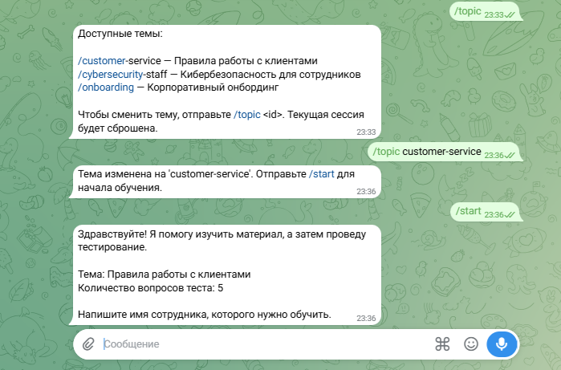
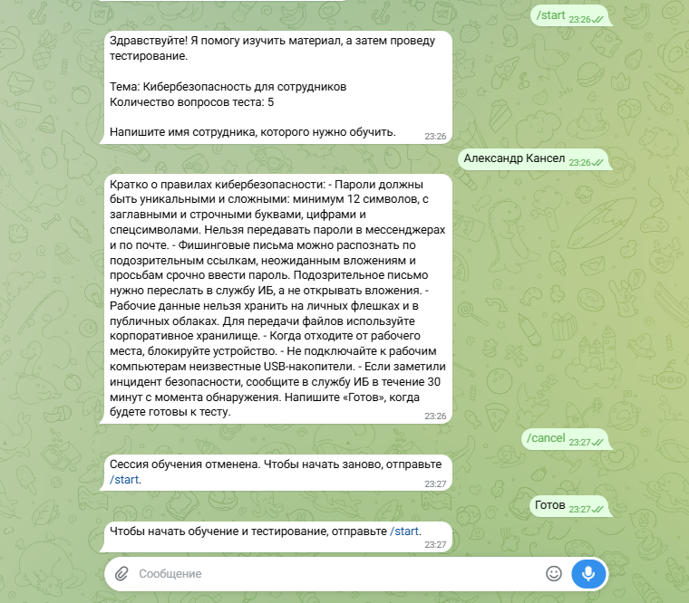
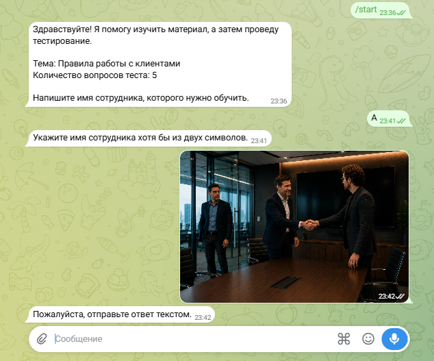

# 📖 Telegram Onboarding Bot · USER_GUIDE

**Проект:** telegram-onboarding-bot
**Дата:** 2026-08-11
**Статус:** Руководство сотрудника, проходящего обучение.

> 📌 **SOT:** Сценарии описаны по фактической реализации бота
> (`bot/handlers/onboarding.py`). Если поведение бота расходится с этим
> руководством — исправляется руководство.

---

## 🎯 1. Для кого

Это руководство для **сотрудника**, который проходит обучение и тест в боте.
Руководство оператора/администратора, управляющего темами, — отдельным
документом: [🎛️ `OPERATOR_GUIDE.md`](OPERATOR_GUIDE.md).

---

## 🧑‍🎓 2. Как пройти обучение

1. Откройте бота в Telegram и отправьте `/start`.
   Бот поздоровается, назовёт тему и количество вопросов теста.
2. Отправьте своё имя (минимум 2 символа, текстом).
3. Бот пришлёт обучающий блок по теме. В конце он спросит, готовы ли вы к тесту.
4. Когда готовы — отправьте `Готов` (или «готов», «давай», «тест», «переходим»).
5. Бот задаст первый вопрос. Отвечайте обычным сообщением.
6. После каждого ответа бот оценит его по материалу, даст короткую обратную
   связь и задаст следующий вопрос.
7. После последнего вопроса бот покажет итог: балл, процент, сильные стороны
   и что стоит повторить. Результат сохраняется в базе.

> 💡 **Совет:** отвечайте своими словами — бот оценивает по смыслу материала,
> а не по точному совпадению слов. На один вопрос — один ответ.

*Полный сквозной диалог: `/start` → имя → обучающий блок → «Готов» → тест из
5 вопросов с обратной связью → итоговый балл 4/5 (80%) и разбор.*

---

## 🚦 3. Сигналы готовности

Бот переходит к тесту по сигналам: «готов», «давай», «тест», «экзамен»,
«переходим». Если просто написать «Готов» в конце обучения — тест начнётся.

---

## 🔀 4. Смена темы

Команда `/topic` без аргументов показывает список доступных тем;
`/topic <id>` — переключает тему. Следующий `/start` начнёт обучение по новой
теме. Текущая сессия при переключении сбрасывается.

*Список доступных тем, переключение и старт обучения по новой теме.*

> ⚠️ Переключение темы меняет активную тему по умолчанию для всех новых
> сессий. Это поведение оператора — см.
> [🎛️ `docs/OPERATOR_GUIDE.md`](OPERATOR_GUIDE.md).

---

## ✋ 5. Отмена

Отправьте `/cancel`, чтобы прервать сессию. После отмены бот попросит
`/start` для новой сессии — обычное сообщение старую сессию не возобновит.

*После `/cancel` бот подтверждает сброс; обычное сообщение без `/start`
не продолжает прерванную сессию.*

---

## 🚫 6. Что бот не делает

- Не подсказывает ответы на вопросы теста.
- Не позволяет вернуться к обучению после начала теста.
- Не завершает тест, пока не проверит все вопросы.
- Не принимает фото/стикер вместо текстового ответа.

*Слишком короткое имя отклоняется; фото или стикер вместо текста — бот
просит прислать текстовое сообщение.*

---

## 📚 7. Связанные документы

- [🏠 `README.md`](../README.md) — назначение проекта и быстрый старт.
- [🎛️ `docs/OPERATOR_GUIDE.md`](OPERATOR_GUIDE.md) — руководство оператора/администратора.
- [🎬 `docs/SYSTEM_DEMO.md`](SYSTEM_DEMO.md) — скриншоты и примеры диалогов.
- [🎬 `docs/E2E_SCENARIOS.md`](E2E_SCENARIOS.md) — сквозные сценарии.
- [🚀 `docs/DEPLOYMENT_GUIDE.md`](DEPLOYMENT_GUIDE.md) — запуск и подключение к БД.
- [🧪 `docs/TESTING.md`](TESTING.md) — результаты тестирования и дефекты.